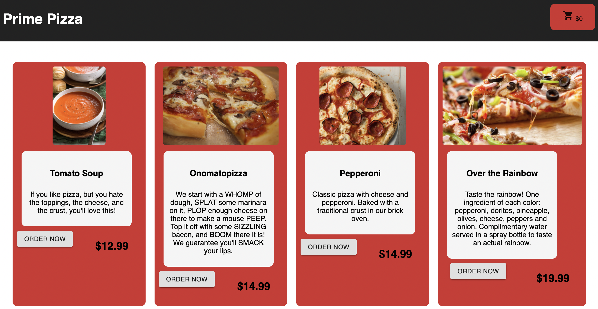

# Redux-Pizza-Parlor

## Description

_Duration: 1.5 Day Sprint_

Order your favorite pizza from our new restaurant!

## Screen Shot

### Prerequisites

- [Node.js](https://nodejs.org/en/)
- Express
- Body Parser
- React
- Redux
- Postgres

## Usage

1. Select Your Favorite Pizza from our menu
2. Submit your name, address, and delivery information
3. Click the checkout button to place your order!

## Built With

- HTML 5
- CSS 3
- Javascript
- node.js
- React / Redux
- Material UI

## Acknowledgement
Thanks to [Prime Digital Academy](www.primeacademy.io) who equipped and helped us to make this application a reality. A huge shoutout to Dane, our instructor, you taught me so much!
